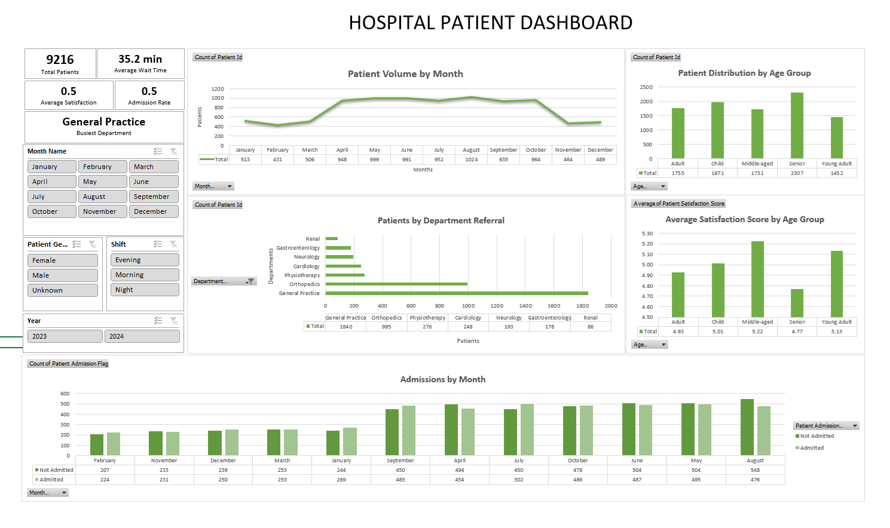

# 🏥 Hospital ER Analytics Dashboard (Excel)

An interactive Microsoft Excel dashboard built to analyze Emergency Room (ER) patient data. The project demonstrates the complete data analysis workflow, from data preparation using Power Query to dashboard creation with Pivot Tables, Pivot Charts, KPIs, and interactive slicers.

---

## 📌 Project Overview

This dashboard provides insights into hospital emergency room operations by analyzing patient volume, admissions, department referrals, waiting time, and satisfaction scores.

The project focuses on transforming raw healthcare data into an interactive dashboard that supports quick business analysis and decision-making.

---

## 📊 Dashboard Preview

> *(Add a screenshot of the dashboard here.)*



---

## ⚙️ Data Preparation

The dataset was cleaned and transformed using **Power Query**.

### Data Cleaning
- Imported raw CSV dataset
- Converted columns to appropriate data types
- Prepared data for reporting and analysis

### Feature Engineering

Additional analytical columns were created:

- Year
- Month Name
- Day Name
- Quarter
- Hour
- Age Group

---

## 📈 Dashboard Features

### KPI Cards
- Total Patients
- Average Wait Time
- Average Satisfaction Score
- Admission Rate
- Busiest Department

### Interactive Visualizations
- Patient Volume by Month
- Patient Distribution by Age Group
- Patients by Department Referral
- Average Satisfaction Score by Age Group
- Admissions by Month

### Interactive Filters
- Year
- Month
- Patient Gender
- Shift

---

## 🛠️ Tools Used

- Microsoft Excel
- Power Query
- Pivot Tables
- Pivot Charts
- Slicers
- Excel Formulas

---

## 📁 Repository Structure

```text
hospital-er-excel-dashboard/
│
├── Hospital_Patient_Dashboard.xlsx
├── README.md
│
├── data
│   └── Hospital_ER_Data.csv
│
└── images
    └── dashboard.png
```

---

## 📌 Skills Demonstrated

- Data Cleaning
- Data Transformation
- Feature Engineering
- Data Visualization
- Dashboard Design
- KPI Reporting
- Business Analytics
- Interactive Excel Dashboards

---

## 📄 Data Source

Public Hospital Emergency Room dataset used for educational and portfolio purposes.

---

## 👤 Author

**Parsa Younessotoodeh**

GitHub: https://github.com/ParsaYSotoodeh